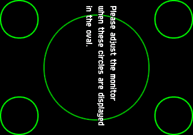
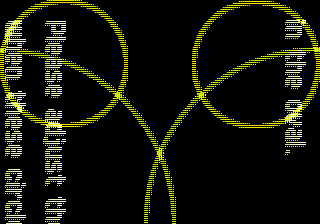

# lrmame (MAME 0.289) — perf-lever results

Companion to [`bench-results.md`](bench-results.md) (mame4all) and
[`bench-results-2003plus.md`](bench-results-2003plus.md) (0.78). This file holds
the 0.289 lever measurements.

Protocol, unchanged and non-negotiable: **interleaved, arm order alternating per
(game, rep), repeated.** Per-cell spread on this device is 1.5–4% and cell order
alone moved one arm by 2%, so nothing under ~5% from a non-interleaved run means
anything. `tools/lever-ab.sh` is the harness; it resumes from its own TSV, so a
run that dies partway does not restart from zero.

Device: MiSTer @ 192.168.20.81, Linux 5.15.1-MiSTer, armv7l, 2 cores,
governor `performance` @ 800 MHz. Core `MAMESTer_20260801.rbf` **loaded** — a
present measurement with no core loaded measures nothing.

Games: `pacman` (Z80, 288x224 @ 60.61 Hz, never touches `drcuml`) and `s1945ii`
(SH-2, `psikyosh.cpp`, 320x224 @ 60 Hz, DRC-backed). Romsets from the MAME 0.260
non-merged set in `roms289/`. 600 frames, 3 reps, sound on, DRC on.

---

## The environment levers

All four arms below run **the same binary against the same
`lrmame_libretro.so`**, so the emulator side is byte-identical and only the host
behaviour differs.

| lever | reps | `pacman` A → B | `s1945ii` A → B | verdict |
|---|---:|---|---|---|
| write-combining (A = `MISTER_NO_WC=1`) | 3 | 90.5 → 104.1 (**+15.0%**) | 32.6 → 34.3 (**+5.0%**) | real |
| `MISTER_SCHED_RT=5` | 6 | 105.4 → 113.3 (see below) | 34.3 → 38.3 (**+11.6%**) | real |
| `MISTER_THREADED_PRESENT=1` | 3 | 105.1 → 103.6 (−1.4%) | 34.4 → 34.4 (+0.1%) | null |
| `MISTER_EMU_CPU=0` | 3 | 104.5 → 105.4 (+0.8%) | 33.9 → 34.1 (+0.6%) | null |

Per-cell spread was under 1% in every cell of the write-combining run, which is
what lets a +5.0% be read as real rather than as the noise floor.

### `SCHED_RT`: report the median on `pacman`, not the mean

The `s1945ii` arm is unambiguous — all six B reps (39.4, 39.1, 37.9, 38.7, 36.9,
37.7) clear all six A reps (34.0–34.5), and mean and median agree at ~+11.5%.

`pacman` is **bimodal**: 107.4, **124.6**, **124.1**, 108.0, 107.3, 108.5. The
+7.5% mean is carried entirely by two runs; the median is 108.25 against a
baseline median of 105.35, i.e. **+2.8%**. A mean over a two-humped sample
describes a frame rate that never occurred, so the honest statement is "+2.8%
typical, occasionally much more" and the cause of the two fast runs is unknown.

The shape across the two games is the opposite of write-combining's, and it fits
the mechanism: RT priority buys back preemption by Main_MiSTer and the two shell
poll loops, and a 29 ms frame offers more chances to be preempted than an 9.5 ms
one. It also means the second core is the contended resource — which is the
direct argument against MAME's own work-queue threading on this box (see
`mame_thread_mode`, below).

### The salvaged host changes: +6.0% / +2.5%

`nv_present.o` at `-O3` plus `build_reverse()` as a constructor, measured as
`lrmame-base` (main's host) against `lrmame-lev` (main + the salvage), **both
linked to the same `lrmame_libretro.so` and both write-combined**: `pacman`
98.8 → 104.7 (+6.0%), `s1945ii` 33.5 → 34.3 (+2.5%), 4 reps, every rep favouring
the salvage.

**The first attempt at this measurement was wrong and is recorded because the
error is easy to repeat.** Comparing against the *deployed* `lrmame` binary gave
+20.8% / +7.1% — but that binary predates `nv_present.c`'s write-combining
support entirely (it prints no `/dev/mem_wc` line and no `present=` field), so
the A arm was Strongly-Ordered and the B arm was not. It re-measured the WC
lever and attributed it to a convert loop. **An A/B between two binaries is only
about the change you made if every other difference between them is zero**, and
"the old one is still on the device" is not that.

### Write-combining is the only large one, and it was switched off

`tools/mister/mem_wc/` has shipped a prebuilt `.ko` since the DDR-throughput
work, and `games/MAMESTer/_handler.sh:84` `insmod`s it at core launch. The
**deployed** handler on the device (dated 2026-08-06 01:49) contains no `mem_wc`
reference at all — it predates that commit. So the module sat at
`/media/fat/games/mame/mem_wc.ko` and was never loaded, `nv_present.c` took its
documented `/dev/mem` fallback, and every launch paid Strongly-Ordered stores.

**PR #7's 88.3 fps gate figure was therefore measured without write-combining.**
The gate passes by more than recorded. The fix is a `deploy.py` run, not a code
change.

`nv_present` says which mapping it got, and the exit line repeats it:

```
nv_present: pixel buffers write-combined via /dev/mem_wc
... present=write-combined
```

Check that string before trusting any present-path number.

### Why the other two are null, and why that is not evidence they are useless

Write-combining cuts the present `memcpy` by roughly the 9.6× the module's own
`ddr-write-bench` arm measures — from ~1.4 ms to ~0.15 ms on a 288x224 RGB565
frame. Both remaining levers exist to hide present cost:
`MISTER_THREADED_PRESENT` moves it to the second A9, `MISTER_EMU_CPU` stops the
emulator migrating away from a warm cache while it happens. With the cost
already gone there is nothing left for either to recover.

Both were measured **with WC on**, which is the shipping configuration, so
"null" is the correct answer for the build that ships. It is not a claim that
they were null before — they were never measured before, and on the
Strongly-Ordered path the arithmetic says threaded present had ~1.4 ms/frame to
work with.

The threaded arm was verified to have actually engaged rather than silently
declining:

```
MISTER-HOST: emulation pinned to cpu0, present worker to cpu1
MISTER-HOST: threaded present (worker owns nv_present)
... 0 present-dropped ...
```

`0 present-dropped` matters: a threaded arm that gets faster by not presenting
is not faster. The 146 underruns in that run are not a threading cost either —
the non-threaded baseline reports 142, and both are `s1945ii` running at half
speed with the audio clock derived from the emulator.

## Renice, and why Main_MiSTer does not need killing

DreamSTer kills `Main_MiSTer` outright. That is not available to us —
`fpga/MAME.sv:332` sources `joystick_0..3` from `hps_io` over `HPS_BUS`, which
only Main_MiSTer drives, so `nv_pads()` would read frozen input; the OSD would
go; and the launch path exists because Main_MiSTer writes the pick to
`/media/fat/config/MAMESTer.s0`. It is also coupled to a decision we did not
make: DreamSTer kills the process *because* it replaces the whole video
pipeline (see `dreamster-ddr-channel-review.md:177-186`).

The point is that we do not need to. There are **four** competitors, not the
two the source comments assume — `/media/fat/MiSTer`, `Master_Daemon.sh`,
`game_manager.sh`, and a `solarus_daemon.sh` left running by a sibling port —
and simply deprioritising them recovers most of what killing them would:

| arm | `pacman` | `s1945ii` |
|---|---:|---:|
| `renice 19` on all four competitors | **+6.5%** | **+6.1%** |
| `MISTER_SCHED_RT=5` alone | +2.8% median | **+11.6%** |
| renice **added on top of** `SCHED_RT` | +6.2% | −0.7% |

**They do not stack**, and the −0.7% is the informative cell: both levers buy
back the same contention, and RT already takes most of it on the heavy driver.
Renice is the safer of the two — its arms are tight (under 1% spread in both
games, against `SCHED_RT`'s bimodal `pacman`), and it carries none of
`SCHED_FIFO`'s risk of an untriaged driver wedging inside `retro_run()` at real
time priority.

**One cell in the first renice run was contaminated by the measurer.** `pacman`
rep 2 arm A came in at 46.7 fps against a 104 baseline because a 58 MB `scp` of
the profiling `.so` was in flight at the time. The row was deleted and the rep
re-run; the corrected figure is the +6.5% above (it was +6.6% with the bad row
merely excluded, so nothing turned on it). Recorded because the failure is
invisible in a summary — a mean over four reps would have reported +23.6%.

## Profile: where `s1945ii`'s 34 fps goes

`MISTER_PROFILE=1000`, 600 frames, 23,643 samples, symbolised against the
`SYMBOLS=1` build. Needs an unstripped core — the shipped
`lrmame_libretro.so` has no `.symtab` at all, so this had to wait for a build.

**19% of the run is ROM load, not emulation.** `sha1_process` 14.8%,
`inflate_fast` 2.3%, `read_rom_data` 1.2%, `sha1_creator::append` 1.0%. That is
one-off checksum verification of the romset, and it is inside the profile on
purpose (`host_main.c` arms the sampler before `retro_load_game` so init cost is
visible rather than hidden). It is a launch-latency item, not an fps one.

Excluding it, the steady state:

| | share of steady state |
|---|---:|
| `[unmapped]` — the DRC code cache (JIT'd SH-2) | **34.1%** |
| `software_renderer<uint32_t,…>::draw_quad_rgb32` | **8.8%** |
| `psikyosh_state::drawgfxzoom` | 4.5% |
| `ymfm::fm_engine_base<opl_registers_base<4>>::clock` | 3.7% |
| `ymfm::pcm_channel::clock` | 1.6% |
| `psikyosh_state::prelineblend` | 1.5% |

The per-function figures cover the top 400 dumped PCs (70% of samples); the
per-module totals are complete and are the check on them.

**`[unmapped]` is the DRC code cache** — JIT-generated code belongs to no
module, so the sampler cannot name it. At 34% it is the SH-2 itself, and it is
already the 7.4× that `drcbearm32` bought over `drcbec`.

**`draw_quad_rgb32` is what makes `M16B` worth a build.** That instantiation is
`software_renderer<unsigned int, 0,0,0, 16,8,0, false, false>` — MAME's *32-bit*
renderer, blitting the screen quad into an XRGB8888 buffer that
`nv_convert_8888_to_565` then converts a second time on our side. `M16B` makes
the core report RGB565 and selects the 16-bit instantiation instead, removing
the wider blit and our convert together. Before this profile that lever was a
speculative arm with a documented bit-rot risk; it now points at a measured
8.8%.

## MAME's own SMP: already enabled, and capped at one worker here

MAME's FAQ describes up to eight cores' worth of threads. Almost none of it can
fire in this build, and what remains was already on.

- **One switch, already on.** The libretro OSD gates the *entire* work-queue
  mechanism on the `mame_thread_mode` core option:
  `osd_get_num_processors()` returns 1 when `!thread_mode` (`osdsync.cpp:96`)
  and `osd_work_queue_alloc()` sets `threadnum = 0` (`osdsync.cpp:294`). The
  option defaults to `"enabled"` (`libretro_core_options.h:98`) and `host_env.c`
  pins nothing for lrmame, so every figure on this page already has it on.
- **Two cores means at most one worker.** `osd_work_queue_alloc` allocates
  `numprocs - 1` threads for `WORK_QUEUE_FLAG_MULTI` queues and 1 for the rest.
- **Four of the FAQ's five thread sources are absent**: bgfx texture upload (no
  GL in this build), output handlers and the HTTP server (not built), OpenMP
  (`genie.lua:966` gates on `OPENMP=1`, unset), and the netlist matrix solver
  (only `nld_log.cpp` references threads here; the parallel solver needs
  OpenMP).
- **The remaining consumers are driver-specific**: `devices/sound/discrete.cpp`,
  `devices/video/poly.h`, `devices/machine/laserdsc.cpp`, `lib/util/chd.cpp`,
  `mame/cave/cv1k_v.cpp`, `mame/sega/coolridr.cpp`. Neither `pacman` nor
  `psikyosh` touches any of them, which is the reason the second core measured
  idle — moving the present onto core 1 gained nothing because core 1 was free.

The FAQ's own caveat is the binding one here: it wants a spare core for the OS,
and this box has exactly two. `SCHED_RT`'s +11.6% is evidence that contention
for the second core already costs frames, so a MAME worker thread would be
competing with Main_MiSTer for the resource RT priority is winning back. Expect
`thread_mode` to be neutral-to-negative on this hardware and measure it on a
discrete-sound driver before believing either sign.

## Levers ruled out without a measurement

- **cpufreq.** `scaling_governor` is already `performance` and
  `scaling_cur_freq` is already 800000. There is nothing to raise.
- **`-O3`.** MAME's `makefile:613` sets `OPTIMIZE = 3` when nothing else does,
  and `tools/build-lrmame.sh` does not, so 0.289 has been building at `-O3`
  from the first gate build. The remaining compiler arms are LTO,
  `-ffast-math` and PGO, not `-O2`-vs-`-O3`.

## Where `s1945ii` stands

34.3 fps baseline against the 60 it needs — a 75% gap. Best measured stack so
far is write-combining + `SCHED_RT` + the salvaged host, and none of the
remaining host-side levers stack with each other, so the ceiling from this page
is roughly 38–39 fps. The profile says why: a third of the steady state is the
JIT'd SH-2 and the rest is spread thin. Closing the gap needs either the
renderer arm (`M16B`, 8.8%) landing well, or a different engine for this driver.

## `M16B` is faster and it renders garbage

Measured, 4 reps, interleaved, both arms built from one tree with `SYMBOLS=1`
and differing only by `-DM16B`:

| game | XRGB8888 | RGB565 | delta |
|---|---:|---:|---:|
| `pacman` | 110.3 | 120.0 | +8.7% |
| `s1945ii` | 36.4 | 37.2 | +2.3% |

**None of which counts, because the picture is wrong.** `libretro_shared.h:10`
defines `HAVE_RGB32` unconditionally next to a `FIXME: re-add way to handle
16/32 bit`, and that bit-rot is real. Same frame of `s1945ii`'s monitor-test
screen through each arm:

| XRGB8888 | `M16B` |
|---|---|
|  |  |

Green circles, upright text and correct geometry become yellow/white circles,
displaced, with the text duplicated and skewed. The skew is a wrong-pitch
signature — something downstream still strides at 4 bytes per pixel — and the
colours being wrong *as well as* the geometry rules out a palette-only fault.

**The frame hash could not have caught this and must not be used as the gate
for this lever.** The two arms legitimately produce different hashes: the
32-bit path renders 8/8/8 and truncates to 5/6/5, the 16-bit path rasterises at
5/6/5 natively, so the rounding differs even when both are correct. A
difference proves nothing and a match was never going to happen. **A screenshot
is the gate.** (The XRGB arm's hash `912aeffbaed7ea59` does match the one PR #7
recorded for `s1945ii`, which is a useful check that this rebuild is equivalent
to the tested one.)

Fixing it means finding the stride bug in 0.289's 16-bit path. Worth ~9% on a
light driver and ~2% on a heavy one, so it is not urgent, and the FPGA route
below gets part of the same win without touching a bit-rotted code path.

## Where the frame time actually goes on a light driver

`pacman`, 1500 frames, 14,032 samples, symbolised:

| | share |
|---|---:|
| `software_renderer<uint32_t,…>::setup_and_draw_textured_quad` | **27.3%** |
| `z80_device::execute_run` | 12.5% |
| libc (largely `memcpy` beneath the above) | 11.2% |
| `nv_frame` — our convert **and** present, the whole host cost | **6.6%** |
| `z80_device::arg_read` | 1.4% |
| `__udivmoddi4` | 1.2% |

**MAME's own render pipeline costs more than twice the emulated CPU.** At
288x224 and 108 fps that is roughly 31 cycles per pixel for what ought to be a
copy — the target is exactly `compute_minimum_size`, so nothing is being
rescaled, and `host_video.c:7` is explicit that **nothing is rotated in
software** (the core hands over an unrotated bitmap and rotation rides the
`SET_ROTATION` path into `nv_set_mode`). So the 27% is neither scaling nor
rotation, and what it *is* has not been established.

`alternate_renderer` is not an escape hatch: it replaces the minimum-size target
with a fixed `altres` (640x360 and friends), which adds a rescale rather than
removing one.

## Can the format conversion be offloaded to the FPGA?

Yes, and it is a different and better proposition than `M16B` — but it is
smaller than the number above.

`nv_frame` is **6.6% on `pacman` and 1.99% on `s1945ii`**, and that figure is
the convert *plus* the DDR present *plus* everything else host-side, so the
convert alone is less. Offloading means writing XRGB8888 straight to DDR and
having the reader select `[23:19]`, `[15:10]`, `[7:3]` at the scanout tap — a
bit-select, not arithmetic. It doubles the per-frame write (129 KB → 258 KB at
288x224), which was unaffordable at the Strongly-Ordered 89 MB/s and is ~0.3 ms
at the write-combined rate.

Three points in its favour over `M16B`: it keeps MAME's 32-bit renderer, which
is the path that demonstrably renders correctly; it deletes the convert rather
than replacing it with a broken one; and it is **not** the offload
`CLAUDE.md` rules out — that prohibition is on *compositing* offload (the
`solarus` blitter model), on the grounds that a MAME driver composites in its
own rasteriser and emits a finished bitmap. Choosing how DDR bytes become
pixels is already the reader's job.

Against it: ~6.6% on a driver that already runs at 108 fps and ~2% on the one
that does not reach 60 is a poor return for an RTL change plus a reader
revision. **The 27.3% sitting next to it is four times the size and has not
been diagnosed.** Diagnose that first; it may turn out to be the thing worth
offloading, or worth avoiding entirely.

## Open

- **The 27.3% render pipeline.** Largest single item found, cause unknown,
  entirely inside MAME's OSD rather than our code.
- **`M16B`'s stride bug** — ~9% / ~2%, in a code path upstream marked FIXME.
- **FPGA format-convert offload** — ~6.6% / ~2%, needs RTL.
- **ROM-load latency.** ~19% of a 21-second run is SHA-1 verification of the
  romset. It costs no frames but it is seconds of launch delay on every start,
  and nothing has looked at whether 0.289 can be told to skip it.
- **`mame_thread_mode` / `OPENMP=1`** — blocked on a discrete-sound romset in
  0.289 format.
- **Compiler arms** — LTO, `-ffast-math`, PGO. Not `-O2`-vs-`-O3`; that is
  already `-O3`.
